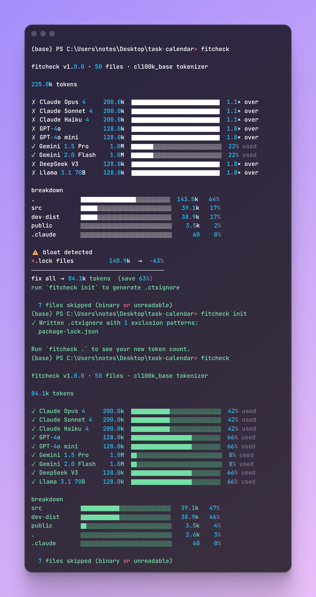

# fitcheck 🚀

> **Know before you prompt.** Stop blinding your AI with `package-lock.json`.

`fitcheck` is a blazingly fast CLI tool that calculates exactly how many tokens your codebase costs, verifies if it fits inside popular LLM context windows, and detects bloat to drastically optimize your AI workflows.



## Why use fitcheck?
- 📉 **Cut Context Bloat:** Automatically identifies massive files that waste tokens.
- ⚡ **Auto-Configure AI IDEs:** Run `fitcheck init --sync` to instantly generate `.cursorignore` and `.aiderignore` files.
- ⚖️ **Cost Your Commits:** Run `fitcheck diff` to see the exact token impact of your uncommitted Git changes.
- 🔒 **100% Local:** Runs entirely on your machine. Zero API keys. Zero telemetry.

## Install

```bash
# Zero install — just run it
npx fitcheck .

# Or install globally for everyday use
npm install -g fitcheck
```

## Commands

| Command | Description |
|---|---|
| `fitcheck .` | Analyze the current directory |
| `fitcheck ./src` | Analyze a specific subfolder |
| `fitcheck . --target claude-sonnet-4` | Focus trim advice on one specific model |
| `fitcheck diff` | Show the token cost of your current uncommitted git changes |
| `fitcheck init` | Generate `.ctxignore` with smart bloat-detection defaults |
| `fitcheck init --sync` | Generate and automatically sync to `.cursorignore` and `.aiderignore` |
| `fitcheck . --json` | Output machine-readable JSON for CI/CD pipelines |

## The `.ctxignore` Standard

Like `.gitignore`, but specifically for AI context windows. Run `fitcheck init` to generate one automatically, or create it manually using standard gitignore syntax.

```text
# .ctxignore
dist/
package-lock.json
yarn.lock
coverage/
*.min.js
```

`fitcheck` natively respects both `.gitignore` and `.ctxignore` when scanning your project.

## Supported Models

All major LLM context windows are checked automatically. The model list lives in [`models.json`](models.json).

**Currently tracked:** Claude Opus/Sonnet/Haiku, GPT-4o, GPT-4o mini, Gemini 1.5 Pro, Gemini 2.0 Flash, DeepSeek V3, Llama 3.1 70B.

## Contributing

We love open source contributions! Whether it's fixing a bug, suggesting a feature, or simply adding a new model to our `models.json` file. Please read our [Contributing Guide](CONTRIBUTING.md) to get started.

## License

MIT
